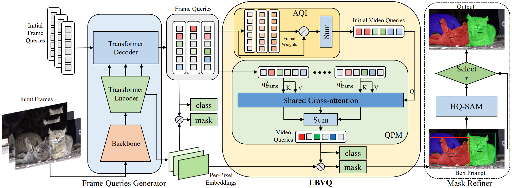

# Learning Better Video Query with SAM for Video Instance Segmentation (TCSVT 2024)

[Hao Fang](https://fanghaook.github.io), Tong Zhang, [Xiaofei Zhou](https://scholar.google.cz/citations?user=2PUAFW8AAAAJ), [Xinxin Zhang](https://scholar.google.cz/citations?user=rPv44PoAAAAJ)

[[`paper`](https://ieeexplore.ieee.org/abstract/document/10418101)] [[`BibTeX`](#CitingLBVQ)]

<div align="center">
  
</div><br/>

## Installation

See [installation instructions](INSTALL.md).

## Getting Started

We provide a script `train_net.py`, that is made to train all the configs provided in LBVQ.

To train a model with "train_net.py" on VIS, first
setup the corresponding datasets following
[Preparing Datasets for LBVQ](./datasets/README.md).

Then run with COCO pretrained weights in the Model Zoo:
```
python train_net.py --num-gpus 8 \
  --config-file configs/youtubevis_2019/lbvq_R50_bs8.yaml \
  MODEL.WEIGHTS mask2former_r50_coco.pkl
```

To evaluate a model's performance, use
```
python train_net.py \
  --config-file configs/youtubevis_2019/lbvq_R50_bs8.yaml \
  --eval-only MODEL.WEIGHTS lbvq_r50_ytvis19.pth
```
If you want to use SAM to refine your results, use
```
python train_net.py \
  --config-file configs/youtubevis_2019/lbvq_R50_bs8.yaml \
  --eval-only MODEL.WEIGHTS lbvq_r50_ytvis19.pth SAM True
```
To visualize a video in the dataset, use
```
python demo_lbvq/demo.py --config-file configs/youtubevis_2019/lbvq_R50_bs8.yaml \
  --input datasets/ytvis_2019/valid/JPEGImages/xxxxxxx/*.jpg \
  --output output/demo --save-frames True \
  --opts MODEL.WEIGHTS lbvq_r50_ytvis2019.pth
```

## <a name="ModelZoo"></a>Model Zoo

### Pretrained weights on COCO
|    Name     | R-50  | R-101 |
|:-----------:| :---: | :---: |
| Mask2Former | [model](https://drive.google.com/file/d/1-KqRhmkNu-FCGL6ssfgW-0jl1UPXXEn6/view?usp=sharing) | [model](https://drive.google.com/file/d/1-JHwIq7LDcRf78d2clBZXfji96CX0TUy/view?usp=sharing) |

### HQ-SAM
|  Name  |   vit_h   |
|:------:|:---------:| 
| HQ-SAM | [model](https://drive.google.com/file/d/1qobFYrI4eyIANfBSmYcGuWRaSIXfMOQ8/view) |

### YouTubeVIS-2019
| Name | Backbone | AP | AP50 | AP75| AR1 | AR10 | Download |
|:----:|:--------:| :---: | :---: | :---: | :---: | :---: | :---: |
| LBVQ |   R-50   | 52.2 | 74.8 | 57.7 | 49.9 | 59.8 | [model](https://drive.google.com/file/d/1-NW-_J3TFta4VyRXYwNp8u5w3Pn5wA7Z/view?usp=sharing) |
| LBVQ |  R-101   | 53.1 | 76.3 | 60.2 | 50.0 | 59.2 | [model](https://drive.google.com/file/d/1-_mF--EijC24ucgSLqD2i2cCRUKCOeit/view?usp=sharing) |

### YouTubeVIS-2021
| Name | Backbone | AP | AP50 | AP75| AR1 | AR10 | Download |
| :---: | :---: | :---: | :---: | :---: | :---: | :---: | :---: |
| LBVQ | R-50 | 44.8 | 67.4 | 46.0 | 41.6 | 52.3 | [model](https://drive.google.com/file/d/1-J9e0cr-Rnh87ukAu90EqabxMehNqgO_/view?usp=sharing) |

### OVIS
| Name | Backbone | AP | AP50 | AP75| AR1 | AR10 | Download |
| :---: | :---: | :---: | :---: | :---: | :---: | :---: | :---: |
| LBVQ | R-50 | 22.2 | 45.3 | 19.0 | 12.4 | 27.5 | [model](https://drive.google.com/file/d/1-QoQ6BWreWZVl6sReu30-rN5TeO2IRSv/view?usp=sharing) |


## License
The majority of LBVQ is licensed under a
[Apache-2.0 License](LICENSE).
However portions of the project are available under separate license terms: Detectron2([Apache-2.0 License](https://github.com/facebookresearch/detectron2/blob/main/LICENSE)), Mask2Former([MIT License](https://github.com/facebookresearch/Mask2Former/blob/main/LICENSE)), and VITA([Apache-2.0 License](https://github.com/sukjunhwang/VITA/blob/main/LICENSE)).

## <a name="CitingVITA"></a>Citing LBVQ

If you use LBVQ in your research or wish to refer to the baseline results published in the Model Zoo, please use the following BibTeX entry.

```BibTeX
@article{Fang2024learning,
  title={Learning Better Video Query with SAM for Video Instance Segmentation},
  author={Fang, Hao and Zhang, Tong and Zhou, Xiaofei and Zhang, Xinxin},
  journal={IEEE Transactions on Circuits and Systems for Video Technology},
  year={2024},
  publisher={IEEE}
}
```

## Acknowledgement

Our code is largely based on [Detectron2](https://github.com/facebookresearch/detectron2), [Mask2Former](https://github.com/facebookresearch/MaskFormer), and [VITA](https://github.com/sukjunhwang/VITA). We are truly grateful for their excellent work.
